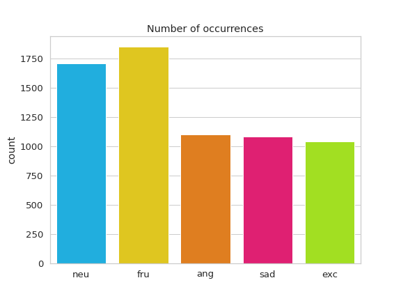
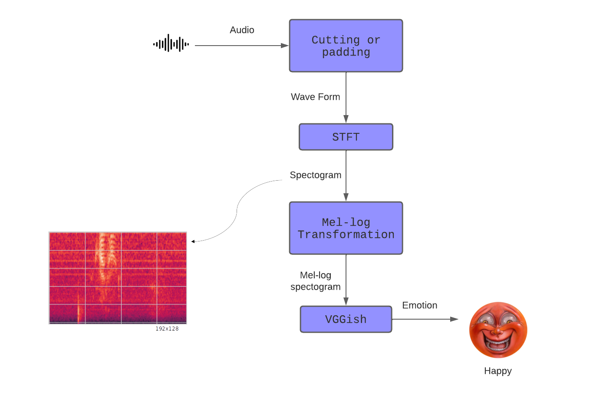
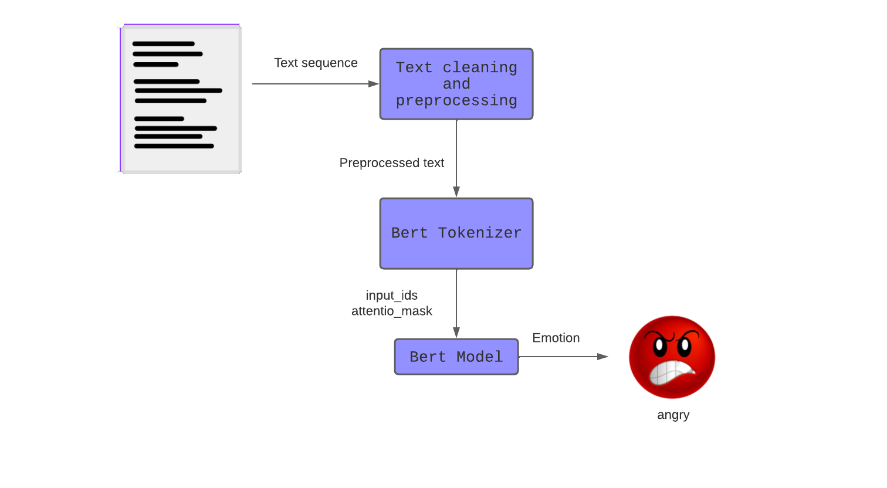
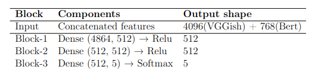
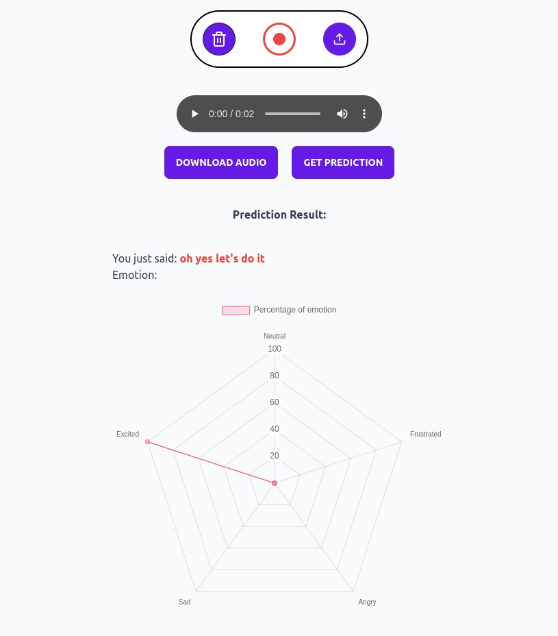
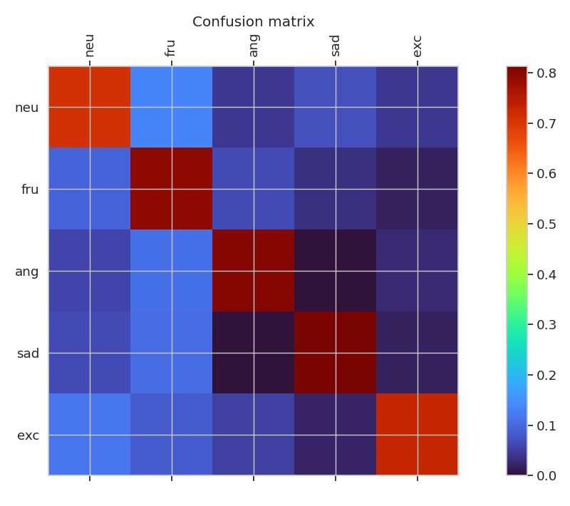
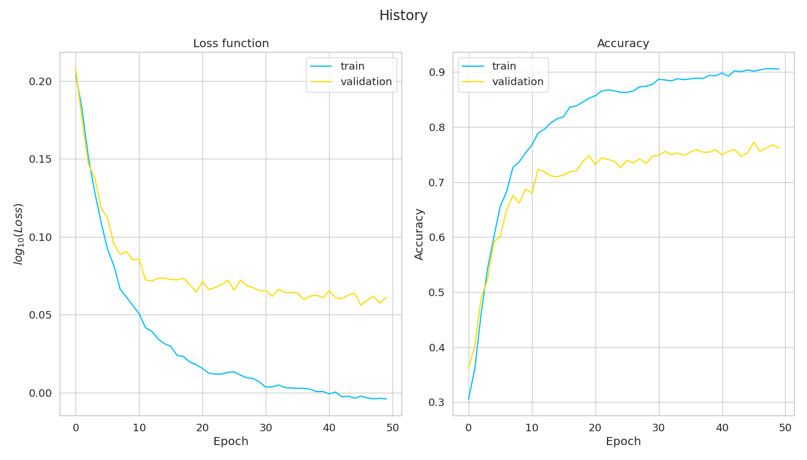
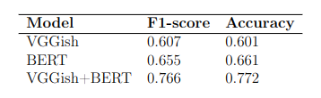

# A multimodal approach to emotion recognition

## Table of Contents
1. [Introduction](#introduction)
2. [Dataset](#dataset)
3. [Model](#model)
4. [Interface](#interface)
5. [Results](#results)
6. [Conclusion](#conclusion)
7. [References](#references)

## Introduction 
This repository contains the code and documentation for an Emotion Recognition model developed using the IEMOCAP dataset. The model utilizes both audio and text modalities to predict the emotions expressed in the input data. The goal of this project is to provide an accurate and robust emotion recognition system that can be used in various applications such as sentiment analysis, virtual assistants, and human-computer interaction.

## Dataset 
It consists of 5 dyadic sessions featuring 10 actors engaged in scripted scenarios and spontaneous conversations. The dataset includes three modalities: audio, text, and motion capture. For this project, the focus was on text and audio modalities. The dataset was preprocessed to filter out emotions with few occurrences and achieve better balance. The selected emotions for analysis were neutral, frustration, anger, sadness, and excitement.

    

## Model 
The Emotion Recognition model follows a multi-modal approach, incorporating audio and text processing techniques to capture the emotional content of the input data. The methodology can be summarized as follows:

    

### Audio processing
The audio files were preprocessed to remove unlabeled files and those labeled with emotions not considered in the model. Next, they were segmented into 3-second samples, ensuring a consistent length for input to the neural network. The samples were then converted into Mel spectrograms, which provide a representation of the audio frequencies and amplitudes. The Mel spectrograms were fed into a VGGish convolutional neural network for further processing and embedding.

    

### Text processing
The text data was preprocessed by removing unwanted characters, converting to lowercase, and tokenizing using the BERT tokenizer. The tokenized text was transformed into input IDs and attention masks, which are used to prepare the data for the BERT model. The BERT model extracts meaningful features from the input text for emotion prediction.

    

### Consolidated model
The emotion recognition model consists of two sub-models: one for audio classification using VGGish and another for text classification using BERT. These sub-models were combined into a consolidated model that takes both audio and text inputs. Fully connected layers were added to the network for classification, and the model was trained using weighted cross-entropy loss, transfer learning and fine-tuned hyperparameters. The performance of the model was evaluated using accuracy and F1-score metrics.

    

## Interface 
A web-based interface was developed using React.js to facilitate the use of the model with custom data. The interface allows users to input audio data, which is then processed using speech recognition to convert it into text. The predicted text is then fed into the emotion recognition model to predict the corresponding emotions. The predicted emotions are displayed in a radar chart visualization, providing a user-friendly way to interact with the model and obtain emotion predictions for custom data.

It's important to note that the interface is designed to run locally on a user's machine. However, we have provided a script that allows for easy deployment of the interface to an Azure server. This script automates the process of setting up the necessary server infrastructure and deploying the web application. By following the provided instructions, users can easily deploy the interface to an Azure server and access it remotely.

This approach ensures that the interface can be accessed and used by multiple users simultaneously, making it more accessible and scalable for broader usage.

    

## Results 
This model achieved reasonable results in predicting emotions from both audio and text modalities. When using only audio, the model achieved an accuracy of 0.601 and an F1-score of 0.607. When using only text, the accuracy improved to 0.655, and the F1-score was 0.661. By combining both modalities, the model achieved the best performance, with an accuracy of 0.766 and an F1-score of 0.772. The model's performance was comparable to similar approaches in the literature.

The confusion matrix for the multimodal emotion recognition model is shown below:

    

The loss and validation curves during the training of the multimodal emotion recognition model are depicted in the following figure:

    

These visualizations provide insights into the performance and training progress of the model, showcasing the accuracy and convergence over epochs.

## Conclusion 
The developed emotion recognition model showed promising results in predicting emotions from audio and text data. The incorporation of both modalities improved the model's performance compared to using either modality alone. The web-based interface provides a user-friendly way to interact with the model and obtain emotion predictions for custom data. Further improvements can be made by expanding the range of emotions and exploring more advanced algorithms and architectures. This project opens avenues for future research in emotion recognition and its applications.

The accuracy of each individual model and the ensemble model on the test set is summarized in the following table:

    

The table provides a comprehensive overview of the performance of each model and highlights the superior performance of the ensemble model. It demonstrates the effectiveness of combining audio and text modalities for emotion recognition.

## References 
1. G.K., VERMA and U.S., TIWARY. "Multimodal fusion framework: A multiresolution approach for emotion classification and recognition from physiological signals." NeuroImage, vol. 102, pp. 162-172, 2014. [Link](https://www.sciencedirect.com/science/article/pii/S1053811913010999)

2. F., ALONSO-MARTÍN, M., MALFAZ, J., SEQUEIRA, et al. "A Multimodal Emotion Detection System during Human–Robot Interaction." Sensors, vol. 13, no. 11, pp. 15549-15581, 2013. [Link](https://www.mdpi.com/1424-8220/13/11/15549)

3. J., ISLAM and Y., ZHANG. "Visual Sentiment Analysis for Social Images Using Transfer Learning Approach." In Proceedings of the IEEE/ACM International Conference on Big Data Computing, Applications and Technologies, pp. 124-130, 2016. [Link](https://doi.org/10.1109/BDCloud-SocialCom-SustainCom.2016.29)

4. M.A., SIKANDAR. "A Survey for Multimodal Sentiment Analysis Methods." 2014. [Link](https://www.semanticscholar.org/paper/A-Survey-for-Multimodal-Sentiment-Analysis-Methods-Sikandar/a9727ad37ddd44355b049084cb2a049367208c1d)

5. T.M., TRUTA, A., CAMPAN, M., BECKERICH. "Efficient Approximation Algorithms for Minimum Dominating Sets in Social Networks." International Journal of Service Science, Management, Engineering, and Technology, vol. 9, pp. 1-32, 2018. [Link](https://doi.org/10.4018/IJSSMET.2018040101)

6. A., TUMASJAN, T., SPRENGER, P., SANDNER, et al. "Predicting Elections with Twitter: What 140 Characters Reveal about Political Sentiment." Word. Journal Of The International Linguistic Association, vol. 10, 2010. [Link](https://doi.org/10.1177/0894439310386557)

7. L., ROBERTS. "Understanding the Mel Spectrogram." Medium, 2020. [Link](https://medium.com/analytics-vidhya/understanding-the-mel-spectrogram-fca2afa2ce53)

8. K., CHEN, M., SHEN, K., YIN, et al. "NeuroMV: A Neural Music Visualizer." Kayo's Blog, 2022. [Link](https://kayoyin.github.io/blog/post/neuromv/)

9. "Multimodal Emotion Recognition on IEMOCAP." Papers with Code. [Link](https://paperswithcode.com/sota/multimodal-emotion-recognition-on-iemocap)

10. S., SADOK. "Multimodal Deep Generative Models." [Link](https://centralesupelec.edunao.com/mod/url/view.php?id=116961)

11. C., BUSSO, M., BULUT, CC., LEE, et al. "IEMOCAP: interactive emotional dyadic motion capture database." Language Resources and Evaluation, vol. 42, no. 4, pp. 335-359, 2008. [Link](https://doi.org/10.1007/s10579-008-9076-6)

12. M.A., ULLAH, M.M., ISLAM, B.A., NORHIDAYAH, et al. "An overview of Multimodal Sentiment Analysis research: Opportunities and Difficulties." In Proceedings of the IEEE International Conference on Imaging, Vision & Pattern Recognition (icIVPR), pp. 1-6, 2017. [Link](https://doi.org/10.1109/ICIVPR.2017.7890858)

13. A.L., CRAMER, H.H., WU, J., SALAMON Salamon, et al. "Look, Listen, and Learn More: Design Choices for Deep Audio Embeddings." In ICASSP 2019 - 2019 IEEE International Conference on Acoustics, Speech and Signal Processing (ICASSP), pp. 3852-3856, 2019. [Link](https://doi.org/10.1109/ICASSP.2019.8682475)

14. S., SHAWN, S., CHAUDHURI, D., ELLIS, et al. "CNN Architectures for Large-Scale Audio Classification." In International Conference on Acoustics, Speech and Signal Processing (ICASSP), 2017. [Link](https://arxiv.org/abs/1609.09430)

15. J., DEVLIN, M.W., CHANG, K., LEE, et al. "Bert: Pre-training of deep bidirectional transformers for language understanding." arXiv preprint arXiv:1810.04805, 2018. [Link](https://doi.org/10.48550/arXiv.1810.04805)

16. C., LISETTI, F., NASOZ, C., LEROUGE, et al. "Developing multimodal intelligent affective interfaces for tele-home health care." International Journal of Human-Computer Studies, vol. 59, no. 1, pp. 245-255, 2003. [Link](https://doi.org/10.1016/S1071-5819(03)00051-X)

17. A., YADOLLAHI, A., A.G., SHAHRAKI, O.R., ZAIANE. "Current State of Text Sentiment Analysis from Opinion to Emotion Mining." ACM Computing Surveys (CSUR), vol. 50, pp. 1-33, 2017. [Link](https://doi.org/10.1145/3057270)